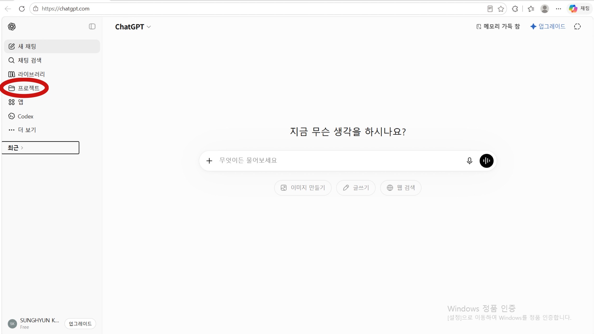
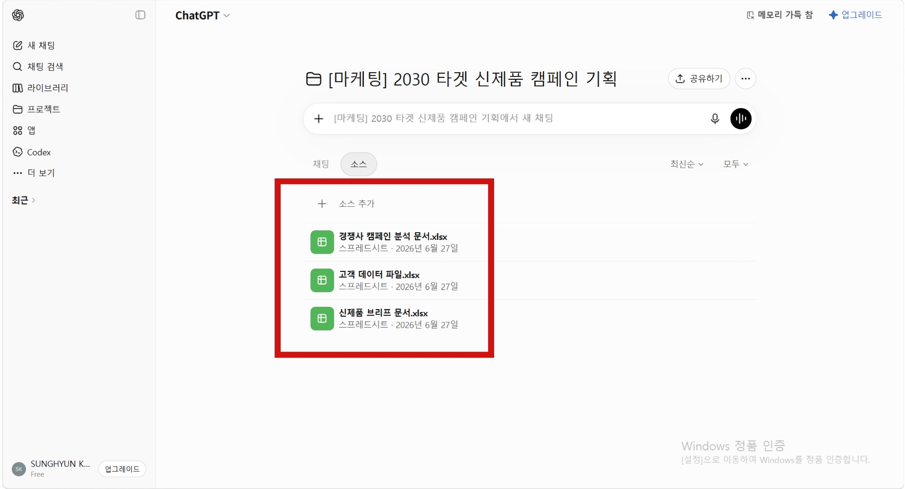
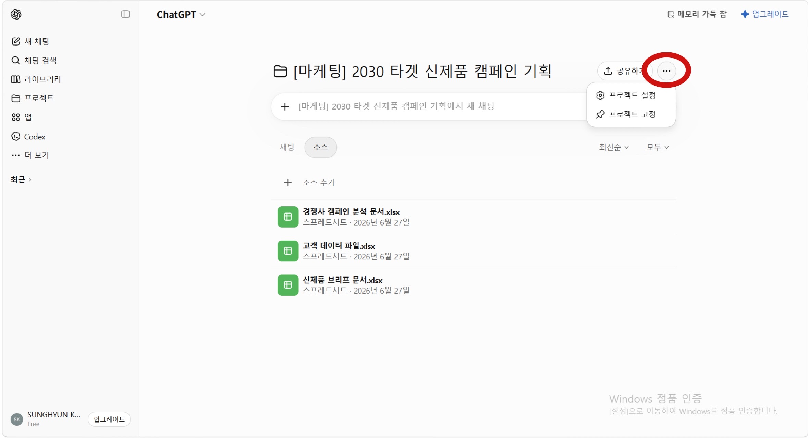
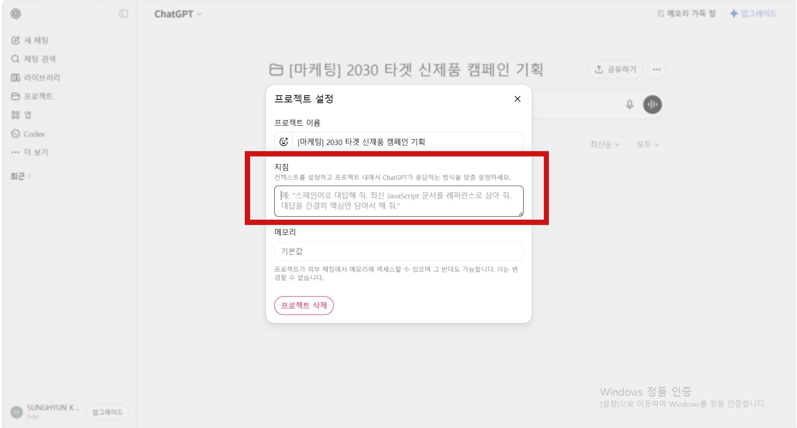
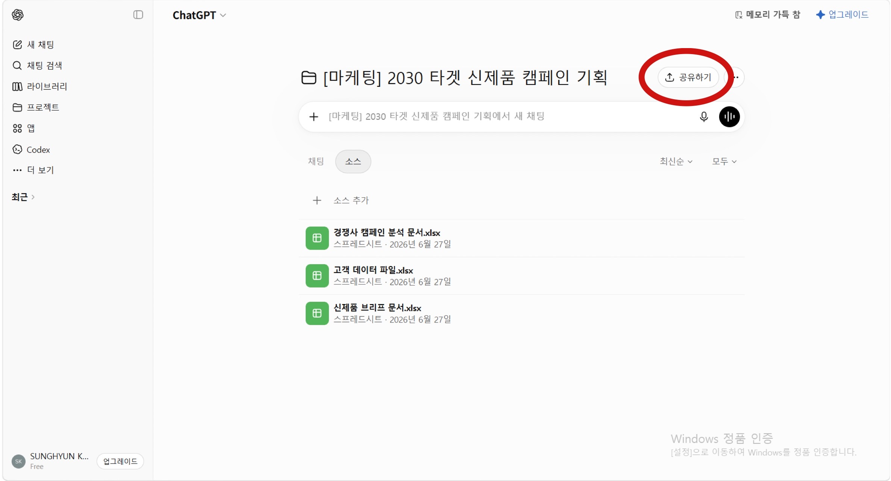
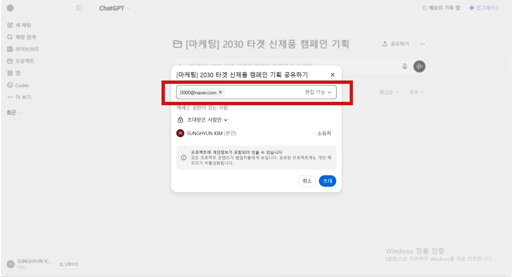
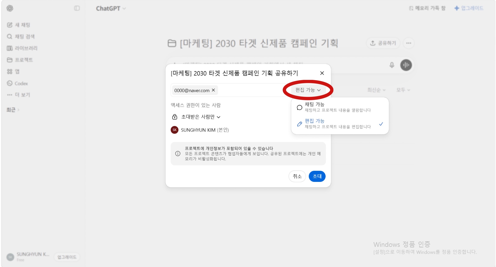
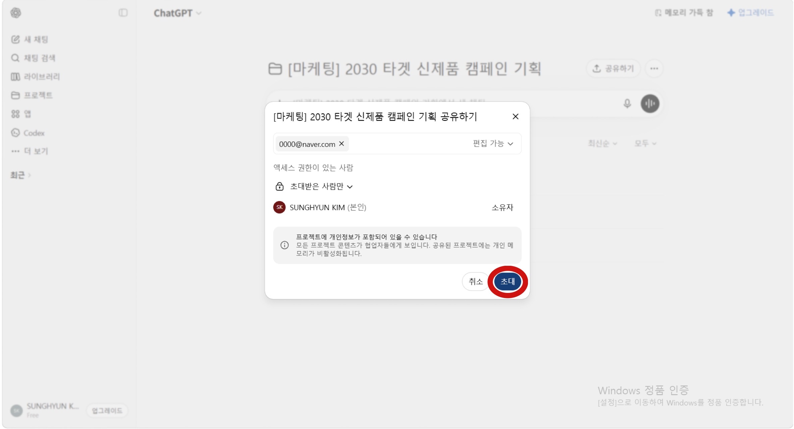
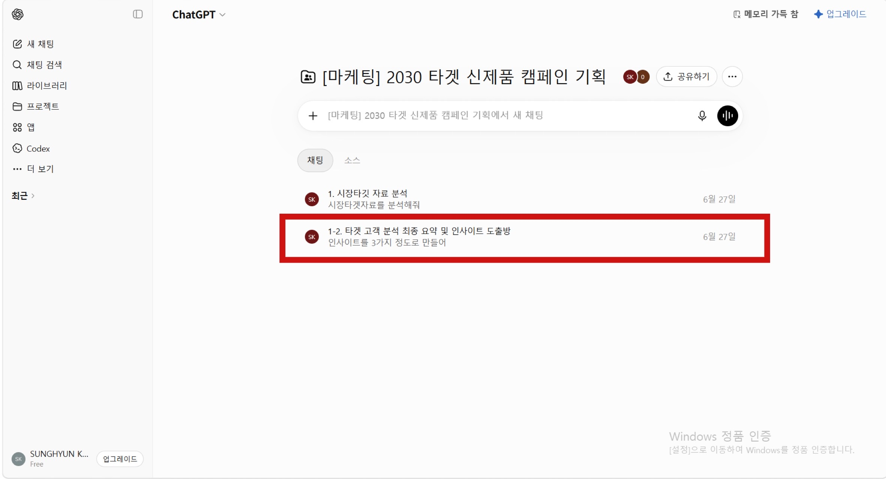
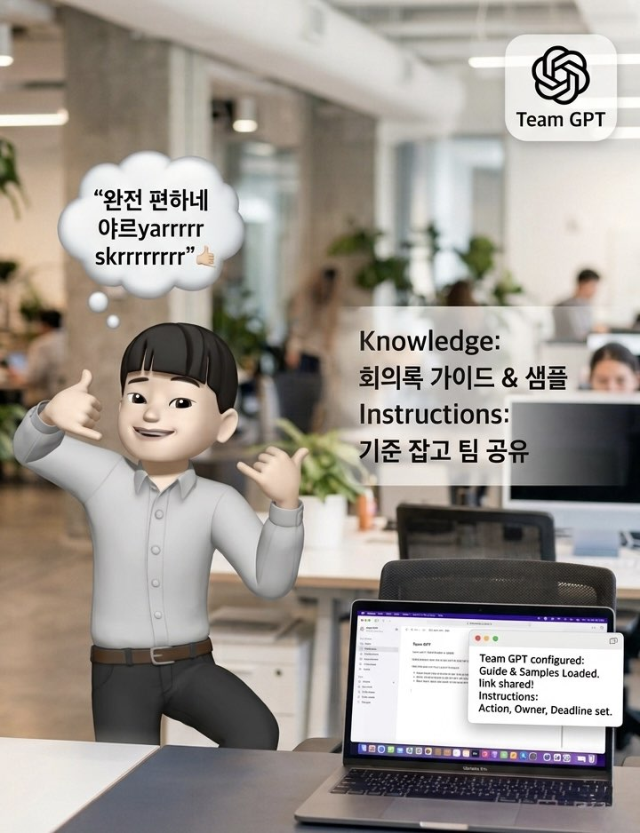

# 제목 없음

# 1편 : 또 학습시키고 시작해요? 저도요. 🔥 🙋


### Before — **지금 우리 팀이 AI를 쓰는 방식**

장원영 씨, 오늘도 새 채팅창을 열었어요.

김재원 씨가 만든 가이드라인을 ChatGPT에 붙여 넣고 또 처음부터 설명 시작.

> "이 가이드라인 참고해서 초안 써줘. 우리 팀 톤은 이렇고, 목적은…"
> 

초안이 나오면 이번엔 김재원 씨 차례. 본인 ChatGPT에 또 넣어요. 배경 설명 또 처음부터. 😵‍💫

새 팀원 오면요? "그 자료 어디 있어요?" 다시 처음부터. 🤦


여기서 잠깐, 손 좀 들어볼게요🙋

혹시 지금 팀에서 AI 쓰는 방식, 이거랑 똑같지 않나요?

근데 여기서 ‘**이것**’ 하나만 더하면? 

---

### After — ‘이것’을 더하고 나서 **🙊**

김재원 씨가 "팀 공유 프로젝트"를 하나 만들었어요.

가이드라인, 조사 자료, 기존 결과물을 넣고 팀원들에게 링크 공유. 끝.

이제 장원영 씨는 이렇게만 말해요.

> "이 방향으로 초안 잡아줘."
> 

AI는 이미 다 알고 있어요. 김재원 씨도 배경 설명 없이 바로 검토 시작. 새 팀원이 와도 링크 하나면 끝. 💁


그래서 '**이것**'이 뭔지 궁금하시지 않나요?

그냥 그렇고 그런 방법 말고, 판을 뒤집는 진짜 비기. 이름하여 👉 “공유 프로젝트” 👈

뭔지 알고 싶으면, 계속 따라오세요.

Let's dig in! 🏃‍♂️‍➡️


---

## **01. 프로젝트란?**

일단 공유 프로젝트를 알기 전에 ‘프로젝트’가 무엇인지 알아야 하겠죠? 👐

단순 1회성 대화방인 일반 채팅창과 달리, 

프로젝트는 **AI에게 '업무 전용 책상'을 만들어주는 기능**이에요.

파일과 지침을 미리 설정해두면 AI가 이를 기준으로 훨씬 일관성 있는 답변을 제공해요. 

**프로젝트의 핵심 기능 4️⃣**

- **지침 설정:** AI의 역할, 말투, 답변 형식 사전 세팅
- **파일 업로드:** 보고서, 가이드 등 업무 참고 자료 첨부
- **대화 관리:** 동일한 주제의 채팅 내역을 한 곳에 보관
- **맥락 유지:** 세팅된 지침과 자료를 바탕으로 정확한 답변 도출

---

## 02. 프로젝트는 언제 쓸까?

프로젝트는 **자료가 많은 업무**, **맥락 유지가 중요한 업무🙆**에 잘 맞아요.

- **여러 파일을 참고해 작업할 때**
- **같은 설명을 반복해야 할 때**
- **톤앤매너나 내부 기준을 유지해야 할 때**

한 번 묻고 끝나는 질문은 일반 채팅이 편해요.

하지만 계속 이어지는 업무라면 프로젝트를 만들어두는 편이 훨씬 효율적이에요.


---

## 03. 공유 프로젝트 🧑‍🤝‍🧑

**공유 프로젝트는 말 그대로 프로젝트를 팀원들과 함께 쓰는 거예요.**

한 명이 세팅해두면, 팀원 모두가 같은 파일·같은 지침·같은 맥락 위에서 바로 작업 시작.

"나 이 자료 AI에 넣어뒀는데, 너도 다시 넣어야 해"는 이제 없어요.

---

## 04. 공유 프로젝트 시작하는 법 🙌

🔗 스텝 보러가기 → (하이퍼링크 달기) 

### Step 1. 새 프로젝트 만들기




ChatGPT 왼쪽 사이드바에서 **프로젝트** 메뉴를 선택하고 새 프로젝트를 만들어요. 

---

### Step 2. 관련 파일 업로드하기⬇️




프로젝트 안에 AI가 참고해야 할 자료를 넣어주세요.

파일은 많을수록 좋은 게 아니라, **기준이 될 만한 자료**를 넣는 게 중요해요.

예를 들어 2030 타겟 신제품 캠페인 기획 프로젝트라면 이런 파일을 넣으면 좋아요

```
고객 데이터 파일
경쟁사 캠페인 분석 문서
신제품 브리프 문서
```

---

### Step 3. 프로젝트 지침 설정하기





지침은 AI에게 “이 프로젝트에서 어떻게 일해야 하는지” 알려주는 업무 매뉴얼이에요.

아래 내용을 넣으면 좋아요. 👇

<aside>

- **작업 배경 설명:** 프로젝트의 목적, 타겟 시청자/독자 등
- **진행 방식 지침:** 어떤 구조와 패턴으로 결과물을 만들어야 하는지
- **어조 및 스타일 선호도:**  “친근하고 에너지 있는 대화체”, “전문 용어는 쉽게 풀어서” 와 같이 구체적인 톤앤매너
- **특정 요구 사항:** 최종 결과물의 형태와 필수 포함 요소 (피해야 할 표현이나 행동)
</aside>

---

### Step 4. 팀원 초대 및 권한 설정 👥

1. 우측 상단에 있는 Share(공유) 버튼을 누릅니다.



1. 초대할 팀원의 이메일 주소를 직접 입력하거나, 지정된 부서 그룹명을 검색해 추가합니다.



1. 권한(Access Level)을 설정합니다.
    - Chat(대화 권한): 프로젝트 내 설정 수정 불가, 세팅된 환경 위에서 대화만 할 수 있습니다. (일반 팀원용)
    - Edit(편집 권한): 프로젝트의 지침을 수정하거나 참고 파일을 삭제/추가할 수 있습니다. (관리자용)
    
    
    
2. 설정을 마치고 Invite(초대) 버튼을 누르면 팀원들에게 알림이 발송됩니다.




---

## 05. 지침, 어떻게 쓰면 좋을까? — 지침 가이드라인

지침은 짧은 것보다 **명확한 것**이 중요해요.

아래 템플릿을 그대로 복사해서 대괄호 안만 바꿔도 좋아요. 😎

```
너는 내 [업무명] 담당자야.

이 프로젝트의 목적은 [목적]이야.

내가 업로드한 자료를 최우선 기준으로 답변해줘.
자료에 없는 내용은 추측하지 말고, 필요한 경우 먼저 확인 질문을 해줘.

답변은 실무자가 바로 사용할 수 있을 정도로 구체적으로 작성해줘.

말투는 [친근하지만 전문적인 톤 / 짧고 명확한 톤 / 보고서용 비즈니스 톤]으로 해줘.

금지할 표현은 [과장된 표현 / 확인되지 않은 수치 / 애매한 말 / 뻔한 조언]이야.
```

```
너는 내 [업무명] 담당자야.

이 프로젝트의 목적은 [목적]이야.

내가 업로드한 자료를 최우선 기준으로 답변해줘.
자료에 없는 내용은 추측하지 말고, 필요한 경우 먼저 확인 질문을 해줘.

답변은 실무자가 바로 사용할 수 있을 정도로 구체적으로 작성해줘.

말투는 [친근하지만 전문적인 톤 / 짧고 명확한 톤 / 보고서용 비즈니스 톤]으로 해줘.

금지할 표현은 [과장된 표현 / 확인되지 않은 수치 / 애매한 말 / 뻔한 조언]이야.
```

---


## 06. 프로젝트를 200% 활용하는 꿀팁🍯

### 팁 1. 파일의 역할을 정해줘요

파일을 올릴 때 “참고해줘”라고만 하지 말고, 자료별 역할을 정해주면 좋아요. 👇

```
업로드한 고객 데이터 파일은 독자의 실제 페인포인트를 파악하는 기준으로 사용해줘.
업로드한 신제품 브리프 문서는 도입부 후킹과 메시지 톤을 잡는 참고 자료로 사용해줘.
```

같은 파일이라도 어떤 역할로 쓰라고 지시하느냐에 따라 결과가 달라져요.

---

### 팁 2. 방을 ‘1회성 작업실’로 인식

대화가 길어지면 GPT가 앞선 맥락을 잊거나 속도가 느려질 수 있어요.

따라서 기존 작업이 끝나면 새 채팅방을 열 것!

- 얘도 디테일요소 참고용으로 새로운 페이지 파서 확인할 수 있게 하면 될까???
    1. `시장·타깃 자료 분석`에서 대화가 충분히 길어졌다면, 기존 방에서 계속 이어가지 말고 왼쪽 메뉴의 `+ New Chat`을 눌러요.
    
    
    
    **2단계 — 새 방 이름을 단계에 맞게 지어요** 
    
    `1-2. 타겟 고객 분석 최종 요약 및 인사이트 도출방`처럼 이전 작업과 연결되는 이름을 붙이면 흐름을 놓치지 않아요.
    
    
    
    **3단계 — 새 방 첫 입력창에 2가지를 함께 넣어요 ⇒** 
    
    
    
    새 방이라도 맥락이 끊기지 않으려면 이전 결과 요약을 꼭 함께 넣어줘야 해요.
    

---

## 07. ChatGPT가 아니어도 활용할 수 있어요

이 방식은 ChatGPT에만 한정되지 않아요.


Claude의 Projects나 Gemini의 Notebook에서도 비슷하게 활용할 수 있어요. 🏘️


---

## 마치며😎


프로젝트는 AI를 더 똑똑하게 만드는게 아니라,

**팀 전체가 같은 맥락에서 AI를 쓰게 돕는 기능**이에요.

초기에 한 번 잘 세팅해두면 매번 자료를 넣을 필요 없이 일관된 결과를 얻고,  새 팀원도 즉시 같은 출발선에서 시작할 수 있죠.

즉, AI를 잘 쓰는 팀은 개인의 프롬프트 실력보다 **AI가 팀을 위해 일할 수 있는 환경을 먼저 만드는 팀🫂**이에요.

다음 편에서는 이 프로젝트 위에 팀 전용 AI 비서를 얹는 방법, GPTs를 소개할게요.

**Let’s dig in! 🏃**

---

# 2편. 매번 똑같은 지시 내릴 건가요? 저도 지겨워서요🥱


# **Before - 팀이 각자 AI를 따로 쓸 때 😮‍💨**

잠깐, 1편 보고 오셨나요?

1편에서 공유 프로젝트로 자료랑 맥락은 이미 한곳에 모았죠. 근데 이런 문제, 아직 남아있지 않나요?


마케팅팀에서 일하는 장원영 씨는 오늘도 새 채팅창을 열었어요.

회의가 끝났고, 팀원들은 각자 회의록을 AI로 정리하기 시작해요. 

장원영 씨는 본인 ChatGPT에 회의 내용을 붙여넣고 정리를 요청하고,김재원 씨도 같은 내용을 본인 AI에 넣고 정리해요. 

결과물 형식은 두 사람이 달라요. 누구 버전을 쓸지 다시 조율해야 해요.


다음 주에도 같은 일이 반복돼요. 팀원이 바뀌어도, 업무가 바뀌어도, 매번 기준을 다시 맞춰야 해요. 😓

---

# **After- 팀 GPT를 만들고 나서 🙌**

김재원 씨가 >팀 회의록 정리 GPT<를 만들었어요.

Knowledge에는 팀의 회의록 작성 가이드라인과 기존 잘 나온 샘플을 넣어뒀어요. Instructions에는 항상 실행 항목, 담당자, 마감일 순서로 정리하도록 기준을 잡아뒀고요. 그리고 팀원들에게 GPT 링크를 공유했어요.

이제 장원영 씨든, 새로 온 팀원이든, 회의 내용을 붙여넣기만 하면 돼요. 

> "오늘 회의 내용 정리해줘."
> 



GPT는 항상 같은 형식으로, 같은 기준으로 정리해줘요. 누가 물어봐도 결과물이 일관돼요. 김재원 씨가 자리를 비워도, 새 팀원이 와도 GPT가 기준을 대신 유지해줘요. 😉

자, 이 ‘팀 회의록 정리 GPT’ — 어떻게 만드는 건지 궁금하시죠? 🕴️

공유 프로젝트는 자료를 모으는 작업방, 이건 반복 업무 방식 자체를 저장해두는 팀 전용 AI 비서, 

👉 “**GPTs**” 👈

매번 설명하던 업무 루틴, 이제 비서한테 맡길 차례예요.

Let's dig in! 🏃

---

## 01. GPTs란?

GPTs는 특정 목적에 맞춰 세팅한 **'맞춤형 전문가 AI'**예요. 

범용적인 일반 ChatGPT와 달리, **딱 맞는 역할** 🤖 을 부여할 수 있죠.

예를 들어 이런 식으로 만들 수 있어요.

```
인스타그램 카피를 써주는 GPT
회의록을 실행 계획으로 바꿔주는 GPT
보고서의 허점을 찾아주는 GPT
브랜드 톤앤매너를 지켜주는 GPT
데이터를 분석해주는 GPT
```

원하는 역할에 맞춰 크게 세 가지를 설정할 수 있어요.

- **지침:** AI의 역할과 답변 기준
- **지식:** 참고할 맞춤형 업무 자료 (가이드, 보고서 등)
- **능력:** 웹 검색, 이미지 생성 등의 추가 기능

즉, GPTs는 "내가 매번 설명하던 업무 방식을 미리 넣어둔 AI 비서"라고 이해하면 쉬워요🙆.

---

## 02. 프로젝트와 GPTs는 어떻게 다를까?

1편의 ‘프로젝트’는 AI가 일할 수 있는 작업방**🧑‍💻**이었다면, 

GPTs는 특정 업무를 반복 수행하는 **전문 도구**에 가까워요.

```
프로젝트 = 업무별 작업방
GPTs = 목적별 AI 비서
```

| 구분 | 프로젝트 | GPTs |
| --- | --- | --- |
| 핵심 개념 | 업무별 작업방 | 목적별 AI 비서 |
| 적합한 상황 | 자료와 대화를 모아 장기 작업할 때 | 반복 업무를 자동화하고 싶을 때 |
| 예시 | 2030 타겟 신제품 개발 | 매거진 도입부 작성 GPT, 보고서 검수 GPT |

---

## 03. GPTs는 언제 사용할까?

GPTs는 **반복되는 작업**, **결과물의 형식이 정해진 작업**, **특정 기준(회사 정책, 팀의 기준)을 계속 지켜야 하는 작업**에 잘 맞아요.

예를 들어 회의록을 작성할 때마다 일반 ChatGPT에게 이렇게 설명해야 한다고 해볼게요.


하지만 GPTs를 만들어두면 다음부터는 회의록만 첨부하면 돼요.


이미 역할, 말투, 형식, 금지 표현이 저장되어 있기 때문에 설명을 반복하지 않아도 돼요🙅.

---

## 04. GPTs 사용 방법 — 직접 만들어 팀원에게 공유하기🧑‍🤝‍🧑

GPTs의 진짜 장점은 내가 직접 만들어서 팀원에게 공유할 수 있다는 것이에요.

GPT는 우리 팀의 업무 방식이나 기준까지 정확히 알지는 못해요. 

그래서 직접 만들어 팀의 업무 방식과 내부 기준을 담은 우리 팀에 딱 맞게 작동하는 GPTs를 만들 수 있어요👐. 


### 만드는 순서

1. 만들고 싶은 GPT의 목적을 정한다.
2. GPT 만들기 화면을 연다.


1. 이름과 설명을 입력한다.


1. Instructions에 역할과 규칙을 적는다.


1. 필요한 경우 Knowledge에 참고 자료를 업로드한다.


1. 웹 검색, 이미지 생성, 데이터 분석 등 필요한 기능을 켠다.


1. 실제 업무 질문으로 테스트한다. 


1. 답변을 보며 지침을 테스트하며 수정한다. 

GPTs는 한 번 만들었다고 바로 완성되는 도구가 아니에요. 

실제 질문을 넣어보고 답변이 원하는 방향으로 나오는지 확인해야 해요.

테스트할 때는 아래를 확인해보세요.

```
내가 넣은 자료를 제대로 참고하는가?
답변 형식이 일정한가?
말투가 원하는 톤과 맞는가?
자료에 없는 내용을 단정하지 않는가?
실무자가 바로 쓸 수 있는 결과물인가?
```

답변이 너무 길거나, 너무 추상적이거나, 원하는 자료를 잘 반영하지 못한다면 Instructions를 수정하면 돼요.

GPTs는 처음부터 완벽하게 만드는 것보다, 실제로 사용하면서 계속 다듬는 것이 중요해요.

1. 공유 범위는 목적에 맞게 설정한다. 

GPTs를 만든 뒤에는 공개 범위를 설정할 수 있어요. 

혼자 쓰는 GPT라면 나만 보기로 설정하면 되고, 팀원들과 함께 쓰고 싶다면 링크 공유나 워크스페이스 공유를 활용할 수 있어요.


외부 사용자도 검색해서 사용할 수 있게 하려면 GPT Store 공개를 선택할 수 있어요. 

 🚨 다만 공개하기 전에는 이름, 설명, 지침, Knowledge 파일, 답변 품질이 의도대로 작동하는지 마지막으로 확인하는 것이 좋아요! 

특히 회사 자료나 내부 문서가 들어갔다면 공개 범위를 신중하게 설정해야 하니,

내부용 GPT는 외부에 공개하지 않고, 필요한 사람에게만 공유하는 것이 안전해요.

처음부터 완벽하게 만들 필요는 없어요. 실제로 써보면서 계속 고치는 것이 더 중요해요.

---

## 06. 지침은 어떻게 쓸까?

Instructions는 GPTs의 핵심이에요.

아래 템플릿을 **그대로** 복사해서 대괄호 안만 바꿔도 좋아요. 👇

```
너는 [역할]이야.

이 GPT의 목적은 [목적]이야.

사용자가 [입력할 내용]을 주면, 너는 [해야 할 작업]을 수행해줘.

답변은 항상 [출력 형식]으로 정리해줘.

말투는 [원하는 톤]으로 작성해줘.

반드시 지켜야 할 기준은 다음과 같아.

1. [기준 1]
2. [기준 2]
3. [기준 3]

피해야 할 것은 다음과 같아.

1. [금지 사항 1]
2. [금지 사항 2]
3. [금지 사항 3]

자료에 없는 내용은 단정하지 말고, 필요한 경우 사용자에게 확인 질문을 해줘.
결과물은 실무자가 바로 복사해 사용할 수 있을 정도로 구체적으로 작성해줘.
```

---

## 07. GPTs를 효율적으로 사용하는 팁 😽

### 팁 1. 필요한 능력만 켜주세요 👀

GPTs를 만들 때는 아래 기능들을 추가할 수 있어요. 

- **웹 검색 (Web Browsing)**
- **캔버스 (Canvas)**
    
    : AI와 결과물을 실시간으로 함께 다듬으며 디테일한 편집 가능.
    
- **이미지 생성 (DALL-E)**
- **코드 인터프리터 (Code Interpreter)**

        : 엑셀 파일 분석, 설문 결과 도출, 복잡한 수치 계산


**Tip.** 목적 없는 '기능 다 켜기'는 응답 속도만 늦춥니다. **정말 필요한 기능만 딱 켜두는 게 '고수'의 세팅법입니다. 🙋**

---

### 팁 2. Knowledge에는 기준이 되는 자료를 넣어주세요 ⬅️

GPTs를 더 똑똑하게 쓰고 싶다면 **Knowledge** 기능을 활용해보세요. Knowledge는 GPT가 참고할 자료를 넣어두는 공간이에요.

예를 들어 이런 자료를 넣을 수 있어요. 👇

```
기존 회의록 정리 형식 예시
팀 프로젝트 일정 가이드라인
직원 핸드북
FAQ 문서
연구 보고서
```


파일을 많이 넣는다고 무조건 좋은 것은 아니에요. 

중요한 것은 "이 GPT가 어떤 기준을 보고 답해야 하는가"예요. 👈

따라서 Knowledge에는 자주 바뀌는 자료보다, 비교적 오래 참고할 수 있는 기준 자료를 넣는 것이 좋아요.

---

### 팁 3. 파일을 넣을 때는 역할까지 함께 정해주세요 🧑‍💼

Knowledge에 파일만 올려두고 끝내면 GPT가 그 자료를 어떻게 활용해야 할지 애매할 수 있어요. 그래서 Instructions에 파일의 역할을 함께 적어주는 것이 좋아요.

예를 들어 이렇게 지시할 수 있어요. 👇

```
업로드한 FAQ 문서는 사실관계를 확인하는 기준으로 사용해줘.
업로드한 정책 문서는 답변의 최우선 기준으로 사용해줘.
```


---

### 팁 4. 지식 기반 답변을 원한다면 Instructions에 꼭 적어주세요 💁

GPT가 Knowledge 파일을 잘 활용하게 하려면 Instructions에 "업로드한 자료를 우선적으로 참고해달라"고 명확히 적어야 해요.

아래 문장을 그대로 활용해도 좋아요. 👇

```
답변할 때는 업로드된 Knowledge 파일을 우선적으로 참고해줘.
자료에 있는 내용은 자료 기준으로 답변하고, 자료에 없는 내용은 임의로 단정하지 마.
필요한 경우 어떤 자료를 참고했는지도 함께 알려줘.
```


특히 답변의 신뢰도를 높이기 위해 사내 정책, 제품 정보와 같은 정확성이 중요한 내용은 출처 표시를 요청하는 것도 좋아요. 

---

## 마치며 😎


GPTs는 AI를 갑자기 완전히 새로운 존재로 바꾸는 기능이 아니에요.

**AI가 특정 일을 더 안정적으로 반복하게 만드는 기능**이에요.

일반 채팅창에서는 매번 설명해야 했던 역할, 기준, 말투, 출력 형식을 GPTs 안에 저장해두면 AI는 그때부터 하나의 전담 비서처럼 움직일 수 있어요. 👨‍💼

AI를 잘 쓰는 사람은 질문을 길게 쓰는 사람이 아니라,

**반복되는 일을 AI가 바로 처리할 수 있도록 구조화해두는 사람**이에요.

